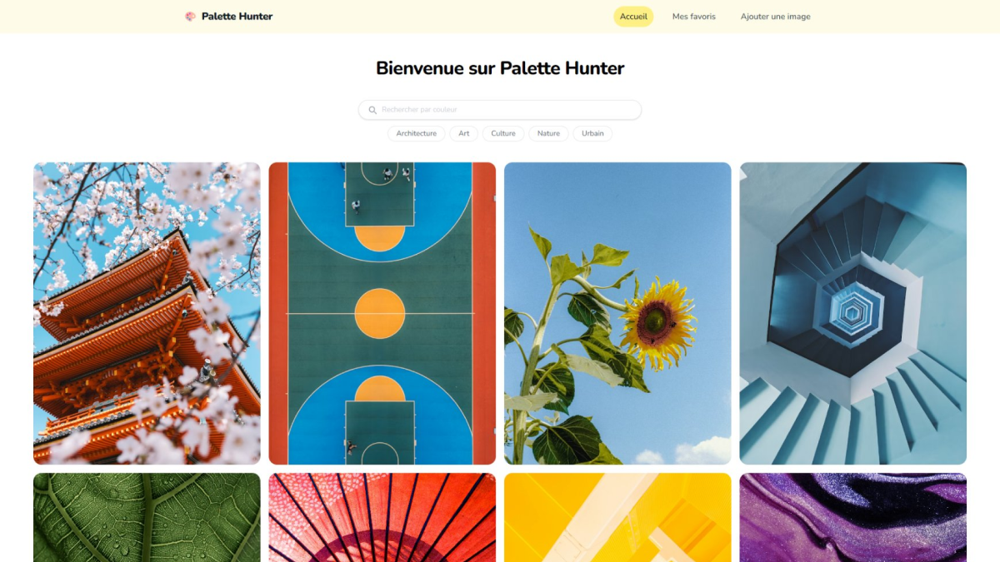
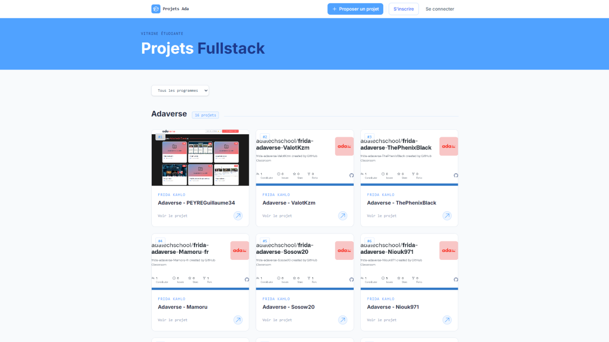
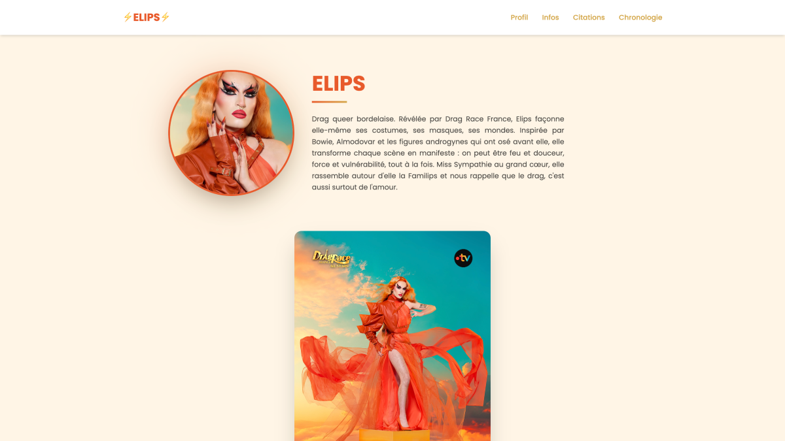

<h1 align="center">👋 Hello, moi c'est Océane</h1>

  🎨 Frontend Developer • Passionnée par l'UX/UI Design

  À la recherche d'une alternance en développement Frontend / UX/UI Design pour Septembre 2026

---

## 🌻 À propos
 
J'aime transformer des idées et des maquettes en interfaces web modernes, intuitives et accessibles, en plaçant l'expérience utilisateur au cœur de ma démarche.

Chaque projet est pour moi l'occasion d'apprendre, d'expérimenter et d'améliorer mes pratiques.

---

## 🛠️ Stack

**Frontend**

  

**Design & Outils**

  

**Backend & Déploiement**

- PostgreSQL
- Neon
- Vercel

---

## 🚀 Projets

<table>
  <tr>
    <td width="33%">
      
       
      <b>🎨 Palette Hunter</b>
       
      Recherche d'images par couleurs, extraction de palettes
    </td>
    <td width="33%">
      
       
      <b>🌍 Adaverse</b>
       
      Plateforme vitrine de projets étudiants, développée en équipe
    </td>
    <td width="33%">
      
       
      <b>⚡ Elips Page</b>
       
      Single page application présentant la drag queen Elips, développée en duo
    </td>
  </tr>
</table>

---

## 📫 Contact

💼 LinkedIn : https://www.linkedin.com/in/oceane-thauvin-a53b36141/  
🌐 Portfolio : https://portfolio-ocette.vercel.app/  
📧 Email : oceane.thauvin@yahoo.fr  

---

💛 *Créer des interfaces simples, utiles et agréables à utiliser.*
